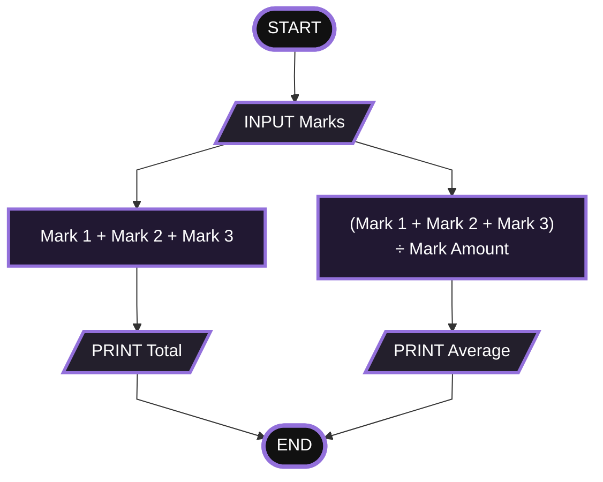
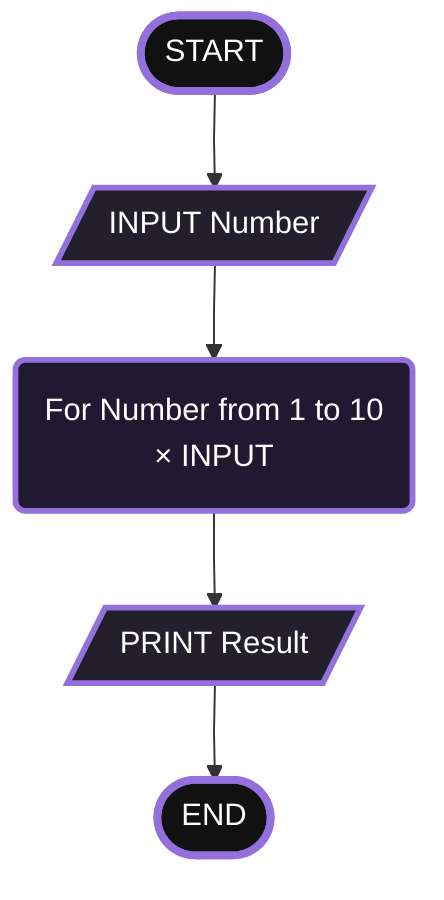
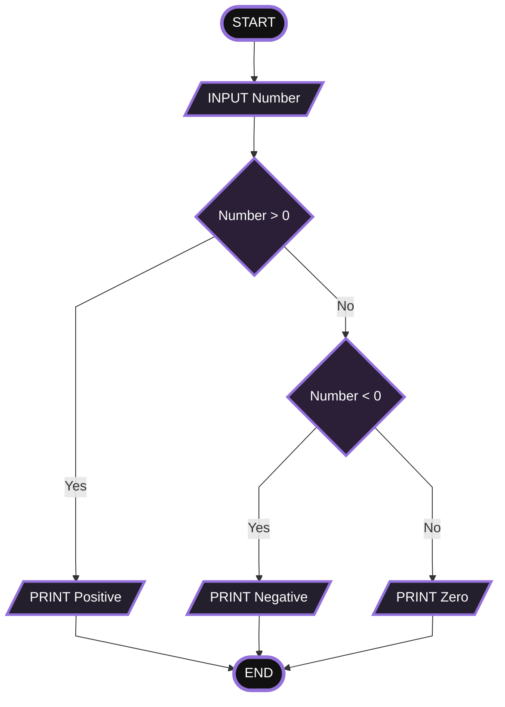
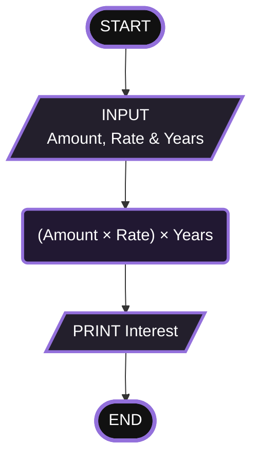
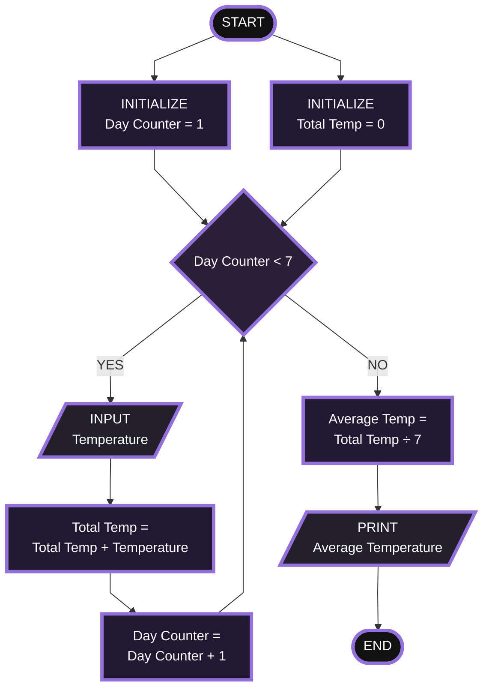
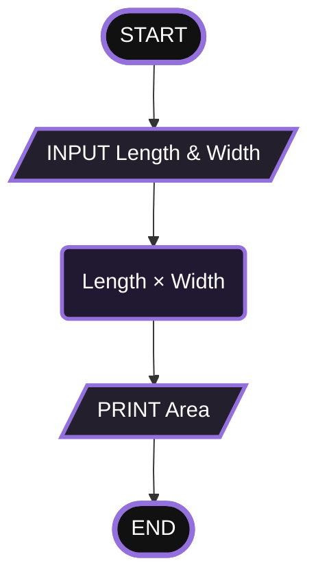
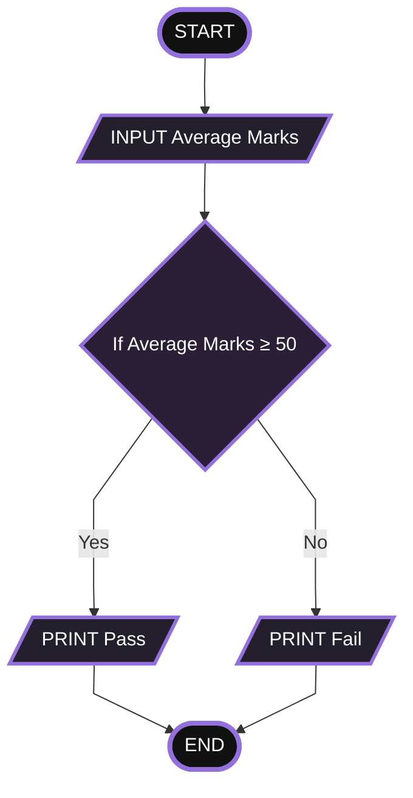
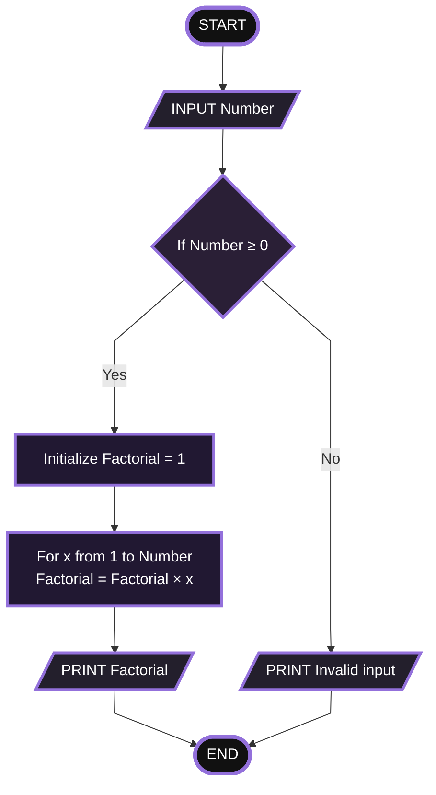
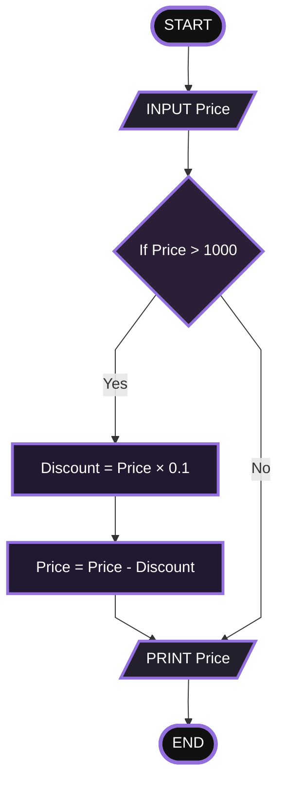

## Flowchart Workshop 2

### TABLE OF CONTENTS

<small>

- [Total & Average](#total--average)<br>
- [Multiplication Table](#multiplication-table)<br>
- [Positive Negative Zero Check](#positive-negative-zero-check)<br>
- [Interest Calculator](#interest-calculator)<br>
- [Average Temperature](#average-temperature)<br>
- [Area For Square](#area-for-square)<br>
- [Pass or Fail](#pass-or-fail)<br>
- [Factorial](#factorial)<br>
- [Calculate Discount](#calculate-discount)

</small>
<br>

### Total & Average

```pseudocode
START
    INPUT mark1,mark2,mark3
    total = mark1 + mark2 + mark3
    average = total / 3
    PRINT total
    PRINT average
END
```

<div align="center">



</div>
</br>
    
### Multiplication Table

```pseudocode
START
    INPUT number
    FOR number FROM 1 TO 10 DO
        result = number * number
        PRINT result
    END FOR
END
```

<div align="center">



</div>
</br>

### Positive Negative Zero Check

```pseudocode
START
    INPUT number
    IF number > 0 THEN
        PRINT "Positive"
    ELSE IF number < 0 THEN
        PRINT "Negative"
    ELSE
        PRINT "Zero"
    END IF
END
```

<div align="center">



</div>
</br>

### Interest Calculator

```pseudocode
START
    INPUT amount,rate,years
    interest = (amount * rate) * years
    PRINT interest
END
```

<div align="center">



</div>
</br>

### Average Temperature

```pseudocode
START
    INITIALIZE daycounter TO 1
    INITIALIZE totaltemp TO 0

    WHILE daycounter <= 7 DO
        INPUT temperature
        totaltemp = totaltemp + temperature
        daycounter = daycounter + 1
    END WHILE

    averagetemp = totaltemp / 7
    PRINT averagetemp
END
```

<div align="center">



</div>
</br>

### Area For Square

```pseudocode
START
    INPUT side1, side2
    area = side1 * side2
    PRINT area
END
```

<div align="center">



</div>
</br>

### Pass or Fail

```pseudocode
START
    INPUT averagemarks
    IF averagemarks >= 50 THEN
        PRINT "Pass"
    ELSE
        PRINT "Fail"
    END IF
END
```

<div align="center">



</div>
</br>

### Calculate Factorial

```pseudocode
START
    INPUT number
    IF number >= 0 THEN
        INITIALIZE factorial TO 1
        FOR x FROM 1 TO number DO
            factorial = factorial * x
        END FOR
        PRINT factorial
    ELSE
        PRINT "Invalid input"
    END IF
END
```

<div align="center">



</div>
</br>

### Calculate Discount

```pseudocode
START
    INPUT price
    IF price > 1000 THEN
        discount = price * 0.1
        price = price - discount
    END IF
    PRINT price
END
```

<div align="center">



</div>
